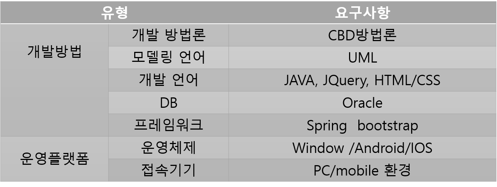
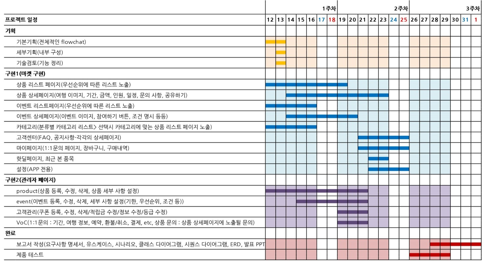

# GreenLight_master [스마트 웹&앱 콘텐츠 개발자과정]
## SpringFramework를 이용한 여행 마켓/관리자 웹&앱 제작
## 여행사 마스터 페이지(관리자 part)
 > DB 공유로 마스터 페이지와 마켓 페이지가 데이터를 공유하는 형태  
 > 마스터 페이지 : 데이터 관리 & 고객 관리  
 > 마켓 페이지 : 데이터 활용 여행상품 판매  
#### :pencil: 3rd Practice : web project using Spring Framework
##### back-end : Spring Framework
##### DB : oracle - mybatis
##### front-end : JavaScript-html(bootstrap)
 > 
##### 반응형 웹으로 웹앱 구현  

***

#### :chart_with_upwards_trend: schedule
 >   

***

 > before start
 > 1. chage setting of DB(url, id, password)
 > 2. Tomcat server setting & run

***

#### :blush: check Doc
 >   
 > [download!](./doc/3차프로젝트.ppt)  

[요구사항명세서](./doc/요구사항명세서.pdf)  
[유스케이스](./doc/유스케이스.pdf)  
[ERD](./doc/ERD.pdf)  
[스토리보드](./doc/master_total_storyboard.pdf)  
